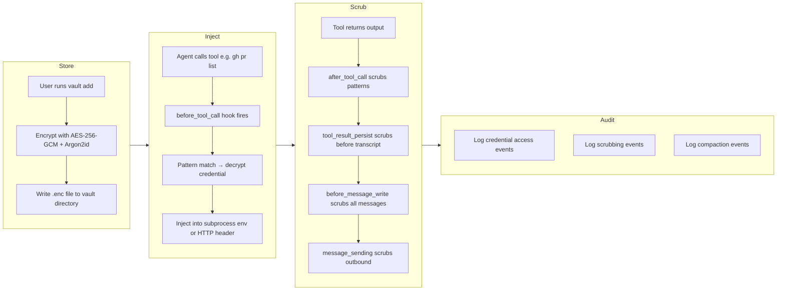
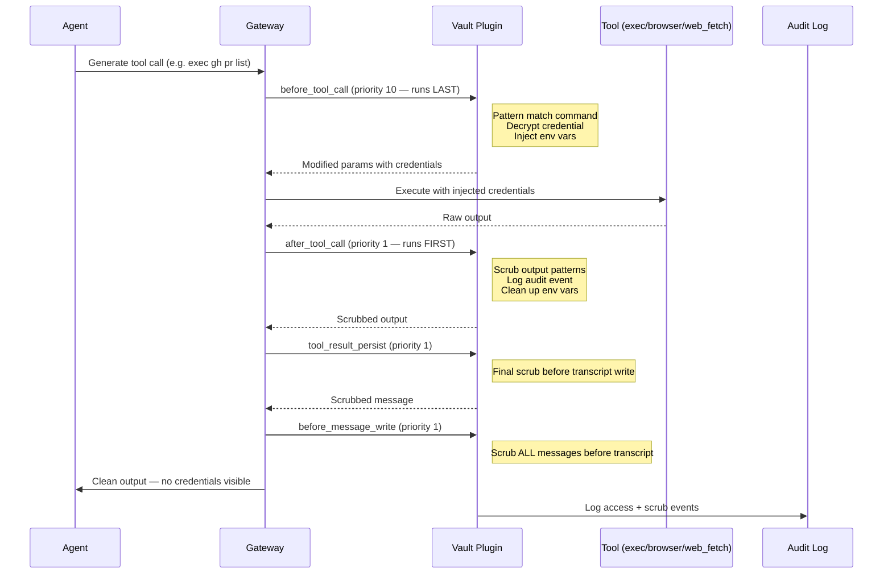
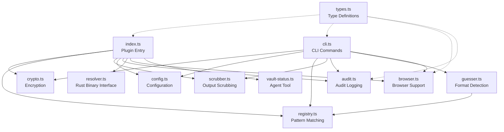
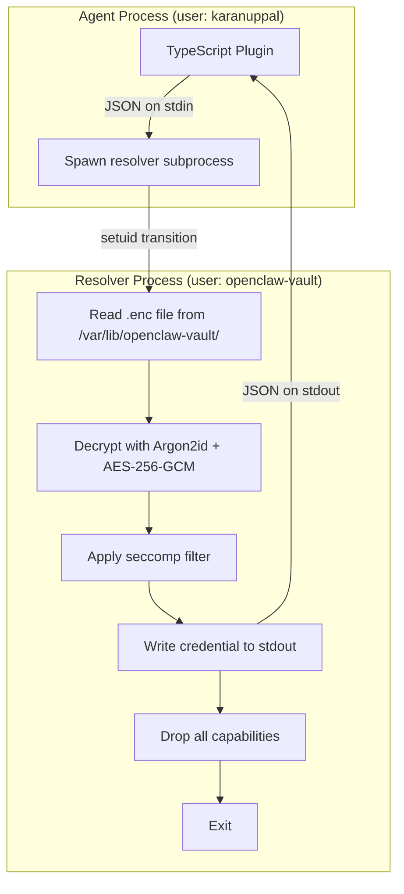

# Architecture

> Understand the OpenClaw Credential Vault in 10 minutes.

---

## Big Picture

The Credential Vault is an OpenClaw plugin that solves a fundamental problem: AI agents need credentials to use external tools (GitHub, Stripe, APIs), but those credentials must never appear in the agent's context window — where they could be exfiltrated via prompt injection, leaked into transcripts, or exposed through tool output.

The vault hooks into OpenClaw's agent loop at multiple points to create a closed credential lifecycle:



## How It Hooks Into OpenClaw

OpenClaw's plugin system provides lifecycle hooks that plugins can register on. The vault registers handlers on 7 hooks, using a split-priority strategy:



**Why split priorities?**
- **Injection (priority 10):** Runs *last* among plugins. The credential is injected as late as possible, right before tool execution. No other plugin ever sees the decrypted credential in params.
- **Scrubbing (priority 1):** Runs *first* among plugins. Credentials are scrubbed from output before any downstream plugin processes the result.

---

## Component Map

The plugin consists of 12 TypeScript modules and a Rust binary:

### Core Pipeline

| Module | Purpose | Key Exports |
|--------|---------|-------------|
| **index.ts** | Plugin entry point. Registers all 7 hooks, CLI commands, vault_status tool, and SIGUSR2 hot-reload handler. Manages in-memory state including credential cache. | `register()` (default), hook handlers |
| **crypto.ts** | Encryption layer. AES-256-GCM with Argon2id key derivation. Handles encrypt, decrypt, file read/write with atomic writes and secure delete. | `encrypt()`, `decrypt()`, `readCredentialFile()`, `writeCredentialFile()` |
| **registry.ts** | Known-tools registry and pattern matching. Ships with built-in rules for Stripe, GitHub, Gumroad, OpenAI, Anthropic, Amazon, Netflix. Glob-to-regex conversion for command and URL matching. | `KNOWN_TOOLS`, `findMatchingRules()`, `detectCredentialType()` |
| **scrubber.ts** | Three-layer output scrubbing pipeline: regex patterns, literal credential matching (indexOf), and env-variable-name matching. Operates on strings and recursive objects. | `scrubText()`, `scrubObject()`, `addLiteralCredential()`, `compileScrubRules()` |
| **config.ts** | Configuration management. Reads/writes `tools.yaml` with atomic writes (tmp+rename), backup/recovery on corruption, and SIGUSR2 signaling for hot-reload. | `readConfig()`, `writeConfig()`, `initConfig()`, `signalGatewayReload()` |

### CLI & UX

| Module | Purpose | Key Exports |
|--------|---------|-------------|
| **cli.ts** | All `openclaw vault` CLI commands: init, add, list, show, rotate, remove, test, audit, logs. Includes tool-name validation (path traversal protection) and interactive prompting. | `registerCliCommands()` |
| **guesser.ts** | Credential format detection. Analyzes a credential value on `vault add` to detect known prefixes (Stripe, GitHub, etc.), JWTs, JSON blobs, passwords, and generic API keys. Suggests injection rules and scrub patterns. | `guessCredentialFormat()`, `buildToolConfigFromGuess()` |

### Browser Support

| Module | Purpose | Key Exports |
|--------|---------|-------------|
| **browser.ts** | Browser credential support. Domain-pinned password injection (`$vault:` placeholder resolution), cookie jar management (parse, filter, inject), and domain matching logic. | `resolveBrowserPassword()`, `shouldInjectCookies()`, `parseCookieJson()` |

### Observability

| Module | Purpose | Key Exports |
|--------|---------|-------------|
| **audit.ts** | Append-only JSONL audit log with 5MB rotation. Logs credential access events, scrubbing events, and compaction events. Supports filtered queries and aggregate statistics. | `logCredentialAccess()`, `logScrubEvent()`, `readAuditLog()`, `computeAuditStats()` |
| **vault-status.ts** | Agent-facing tool (`vault_status`). Returns credential names (never values), rotation health, and last access times. Registered as an optional agent tool. | `createVaultStatusTool()` |

### Infrastructure

| Module | Purpose | Key Exports |
|--------|---------|-------------|
| **types.ts** | TypeScript interfaces for the entire plugin: injection rules, scrub configs, tool configs, audit events, plugin API, CLI program, Playwright cookies. | All type definitions |
| **resolver.ts** | Interface to the Rust resolver binary. Finds the binary, spawns it as a subprocess, passes tool requests on stdin, reads credentials from stdout. Handles structured error codes. | `resolveViaRustBinary()`, `findResolverBinary()` |

### Component Interaction



---

## The Rust Resolver

### What It Does

The Rust resolver (`openclaw-vault-resolver`) is a standalone static binary that decrypts credentials in a separate OS process. It implements the same AES-256-GCM + Argon2id scheme as the TypeScript crypto module, producing byte-identical key derivation output.

### Why It's Separate

In **inline mode** (Phase 1), the TypeScript plugin reads and decrypts `.enc` files directly. This works, but both the agent and the vault run as the same OS user — the agent *could* read the encrypted files (though it can't decrypt them without the key derivation material).

The Rust resolver enables **binary mode** (Phase 2) with true OS-level separation:



### The setuid Model

1. The resolver binary is installed at `/usr/local/bin/openclaw-vault-resolver`
2. It's owned by the `openclaw-vault` system user with the setuid bit set (`4755`)
3. Credential files live in `/var/lib/openclaw-vault/` (mode 700, owned by `openclaw-vault`)
4. When the agent process spawns the resolver, the binary runs as `openclaw-vault` — it can read the credential files that the agent cannot
5. The resolver decrypts the credential, writes it to stdout, then:
   - Installs a seccomp filter restricting syscalls to read/write/exit/brk/mmap/munmap/close/fstat/futex/getrandom
   - Drops all Linux capabilities
   - Exits

The agent receives the credential on stdout but never has direct access to the encrypted files or the decryption key material.

### Interface Protocol

```
stdin  → {"tool": "github", "context": "exec", "command": "gh pr list"}
stdout ← {"credential": "ghp_...", "expires": null}
stderr ← {"error": "EPERM", "message": "..."}  (on failure)

Exit codes: 0=success, 1=not found, 2=decrypt failed, 3=permission denied, 4=seccomp violation
```

---

## Hook Pipeline

The vault registers handlers on 7 OpenClaw plugin hooks. Here's the complete flow:

### Hook Registration

| Hook | Priority | Mode | Purpose |
|------|----------|------|---------|
| `before_tool_call` | 10 (last) | Mutate | Inject credentials into tool params; scrub write/edit content |
| `after_tool_call` | 1 (first) | Observe | Audit logging; env var cleanup |
| `tool_result_persist` | 1 (first) | Mutate | Scrub tool results before transcript write |
| `before_message_write` | 1 (first) | Mutate | Scrub all messages before transcript |
| `message_sending` | 1 (first) | Mutate | Scrub outbound messages to user |
| `after_compaction` | default | Observe | Log that compaction occurred |
| `gateway_start` | default | Observe | Validate vault, check rotations, warm credential cache |

### before_tool_call (injection + write/edit scrubbing)

This is the most complex hook. It handles four distinct flows:

1. **Write/edit scrubbing**: If the tool is `write` or `edit`, scrub credential patterns from the content parameter before the file is written
2. **Browser password**: If the tool is `browser` and text contains `$vault:name`, resolve the placeholder after domain-pin validation
3. **Browser cookies**: If the tool is `browser` with `navigate` action, inject matching cookies via `_vaultCookies` param
4. **Standard injection**: For `exec` and `web_fetch`, pattern-match the command/URL against configured rules and inject credentials as env vars or HTTP headers

### Scrubbing Layers (all output hooks)

Every output hook applies the same three-layer scrubbing pipeline:

1. **Regex patterns**: Tool-specific patterns (e.g., `ghp_[a-zA-Z0-9]{36}` for GitHub) plus global patterns (Telegram bot tokens, Slack tokens)
2. **Literal matching**: `indexOf`-based search for exact credential values that were decrypted during injection (catches credentials with no recognizable format)
3. **Env variable names**: Pattern matching for `KEY=[VAULT:env-redacted] `TOKEN=[VAULT:env-redacted] `SECRET=[VAULT:env-redacted] `PASSWORD=[VAULT:env-redacted] values in output — redacts the value portion

### Error Handling

All hook handlers are wrapped in try-catch blocks that:
- Log errors to `~/.openclaw/vault/error.log` (only when `OPENCLAW_VAULT_DEBUG` is set)
- **Fail open**: on error, the hook returns void (lets content through unscrubbed) rather than crashing the gateway
- This is a deliberate design trade-off — blocking all output on a scrubbing bug would be worse than a potential credential exposure

---

## Configuration & State

### File Layout

```
~/.openclaw/vault/
├── tools.yaml              # Tool configs: injection rules, scrub patterns, rotation metadata
├── .vault-meta.json        # Vault metadata: creation time, install timestamp, key mode
├── audit.log               # Append-only JSONL audit log (5MB rotation)
├── audit.log.1             # Rotated backup
├── error.log               # Debug error log (only when OPENCLAW_VAULT_DEBUG set)
├── tools.yaml.bak          # Auto-backup for corruption recovery
├── github.enc              # Encrypted credential files (one per tool)
├── stripe.enc
└── gumroad-api.enc

/var/lib/openclaw-vault/     # Binary mode only (owned by openclaw-vault user)
├── .vault-meta.json
├── github.enc
└── ...
```

### Credential Cache

Decrypted credentials are cached in memory to avoid repeated Argon2id derivation (which is intentionally expensive — 64 MiB memory, 3 iterations):

- **TTL**: 15 minutes — after which credentials are re-decrypted on next access
- **Eviction**: Expired entries are evicted on access, not proactively
- **Hot-reload preservation**: On SIGUSR2 config reload, the cache is preserved if the passphrase hasn't changed
- **Gateway start**: All credentials are pre-warmed into cache during `gateway_start`

### Hot-Reload

When the user runs any `vault` CLI command that modifies config (add, rotate, remove), the CLI:

1. Writes the updated `tools.yaml` (atomic: tmp + rename)
2. Sends SIGUSR2 to the gateway process (via PID file at `~/.openclaw/gateway.pid`)
3. The plugin's SIGUSR2 handler re-reads config and recompiles scrub rules
4. No gateway restart required — changes take effect immediately

---

## Credential Resolution Modes

The vault supports two resolution modes, configurable in `tools.yaml`:

| Mode | Security Level | How It Works |
|------|---------------|--------------|
| **inline** (default) | Encrypted at rest, same OS user | TypeScript reads `.enc` files from `~/.openclaw/vault/` and decrypts in-process |
| **binary** | OS-level user separation | TypeScript spawns the Rust resolver (setuid `openclaw-vault`), which reads files from `/var/lib/openclaw-vault/` |

Users run `sudo bash vault-setup.sh` to enable binary mode. The setup script creates the system user, installs the setuid binary, migrates credential files, and updates `tools.yaml` to set `resolverMode: binary`.

Without the setup script, the vault works in inline mode — still encrypted, still scrubbed, but without the OS-level permission boundary.
